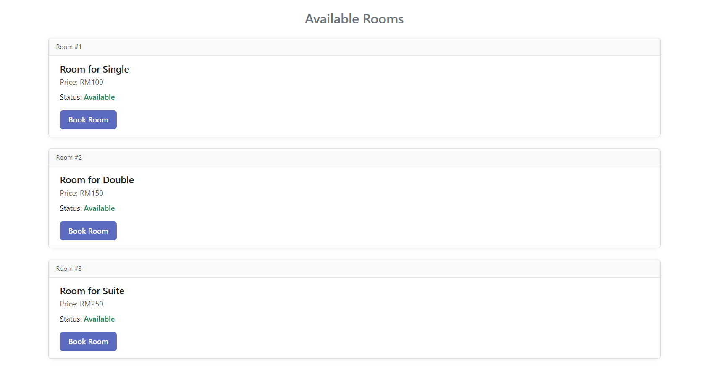
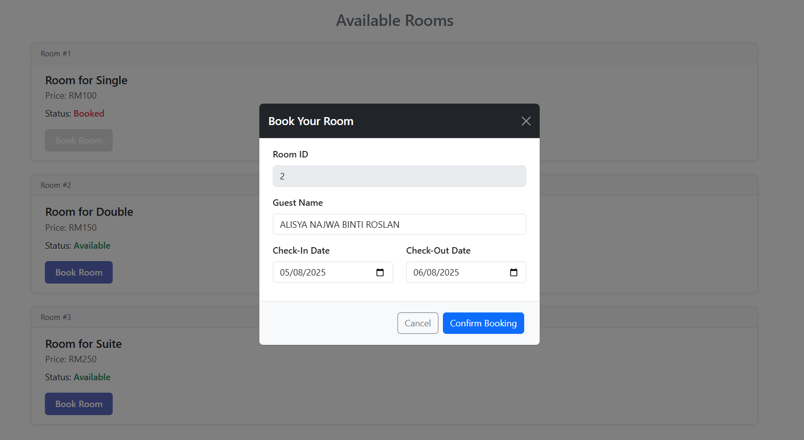

# 🏨 Hotel Room Booking App

A responsive web application to view and book hotel rooms. Guests can view available rooms, select check-in/check-out dates, enter their name, and book a room using a simple UI.

---

### ✨ Features
- List of hotel rooms with ID, type, price, and availability
- Booking form in modal popup (guest name, check-in/out date)
- Simulated booking action using local state
- Success toast notification after booking
- Clean, responsive UI built with Bootstrap

---

### 🚀 How to Run the App
1. **Clone the repository:**
   ```bash
   git clone https://github.com/qtyeov/hotel-booking-app.git
   cd hotel-booking-app

2. **Install the dependencies:**
   ```bash
   npm install

3. **Start the Angular development server:**
   ```bash
   ng serve

---

### 📦 Assumptions Made

- All room data is hardcoded and simulated using RxJS of(...).
- Booking actions update local in-memory state only (no backend).
- Bookings do not persist after page reload.
- Minimal input validation is used — assumes user provides valid name and dates.
- No authentication or admin features are included in this version.

---

### 🧩 Screenshots

Room Listing            |  Booking Modal
:-------------------------:|:-------------------------:
 | 

---

### 🛠 Tech Stack

- **Framework:** Angular 17+
- **Language:** TypeScript
- **Styling:** SCSS + Bootstrap 5
- **State Management:** Local state with RxJS
- **API Simulation:** RxJS `of(...)` mock data

---

### 📦 Project Structure

```bash
src/app/
├── book-room/          # Booking modal component
├── room-list/          # Room list display component
├── services/           # Room service (mock API)
├── models/             # Room model interface
